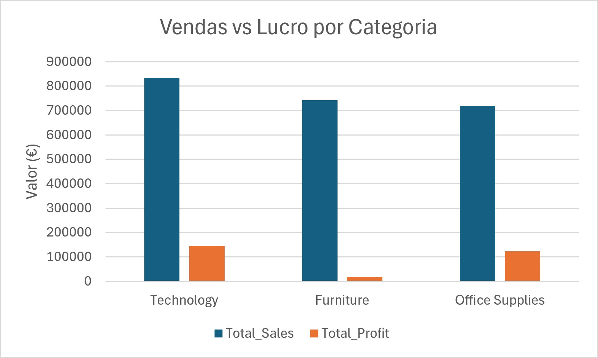
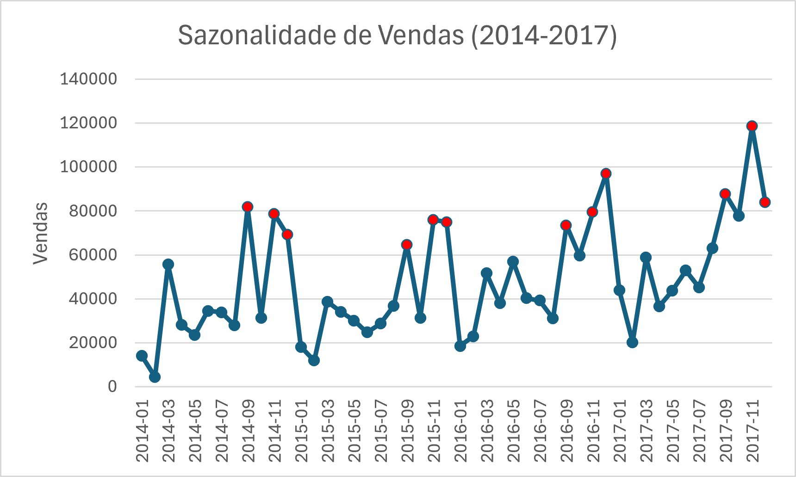
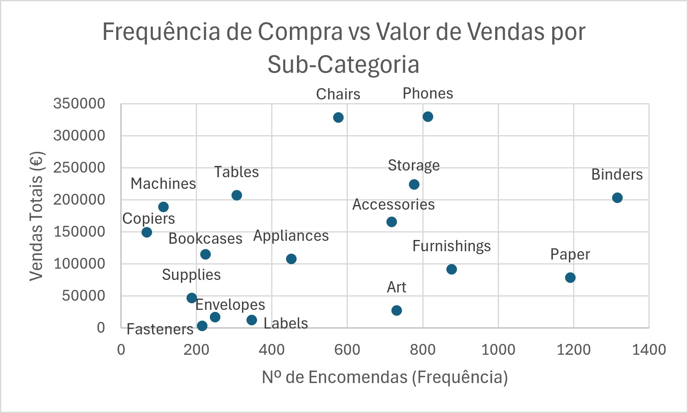
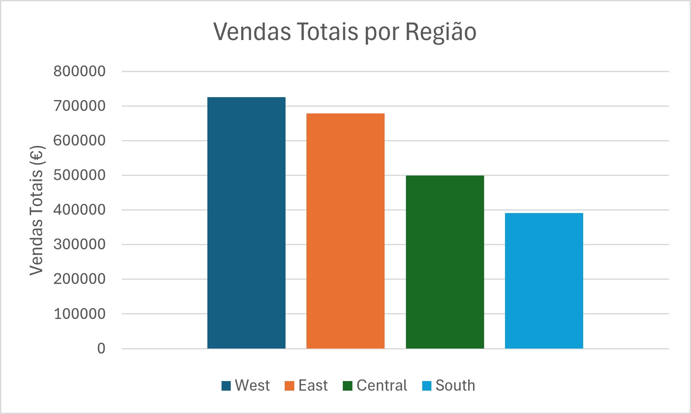

# Retail Demand & Inventory Analysis

Analysis of demand patterns and inventory rotation for a multi-category retailer, using the Ask → Prepare → Process → Analyze → Share → Act framework to translate raw sales data into actionable inventory recommendations.

## Business Problem
Inventory decisions were being made without systematic demand analysis, creating risk of stockouts in high-rotation products and excess holding costs in low-rotation ones. This project identifies demand patterns by category and region to inform a data-driven approach to stock replenishment.

## Objective
* **Business question:** What are the demand patterns by category and region, and how can they inform inventory replenishment decisions?
* **Stakeholder:** Operations & Inventory Manager — needs to decide how much stock to order, by category and region, for the next quarter.

## Dataset
* **Source:** Superstore Sales Dataset (Kaggle)
* **Size:** 9,994 transactions, 21 original columns + 2 derived
* **Period:** January 2014 – December 2017
* **Scope:** United States market, 3 categories (Technology, Furniture, Office Supplies), 4 regions

## Methodology

| Phase | What was done |
| :--- | :--- |
| **Ask** | Defined the business question, stakeholder, and 4 measurable sub-questions. |
| **Prepare** | Confirmed dataset structure (9,994 rows, 21 columns, 2014–2017), documented limitations upfront. |
| **Process** | Converted US MM/DD/YYYY order/ship dates to DD/MM/YYYY. Reviewed region and category columns via data validation to prevent inconsistent formats. Created `Order month` and `Shipping days` columns to analyze seasonality and delivery times. Fixed SQL import errors by changing the delimiter to `;` and skipping 1 header row. Removed duplicates and ghost rows in Excel prior to import. |
| **Analyze** | Answered all 4 sub-questions using SQL (BigQuery), calculating averages based on distinct orders (`COUNT(DISTINCT Order ID)`). |
| **Share** | Built 4 visualizations in Google Sheets, exported as static charts. |
| **Act** | Translated findings into 4 concrete, data-backed recommendations. |

**Full SQL queries:** [queries.sql](sql/queries.sql)

**Full dataset:** [project_retail.xlsx](project_retail.xlsx)

---

## Key Findings

### 1. Category performance: revenue ≠ profit
Technology leads in both sales ($834,227) and profit ($145,046). Furniture generates revenue nearly identical to Office Supplies ($742,000 vs $719,047) but profit margin is 2.5%, versus 17% for the other two categories — a margin problem, not a demand problem.

  

### 2. Seasonality is consistent, not random
Sales peak every year in September and November–December, across all 4 years analyzed. The all-time high was November 2017 ($118,448). January is consistently the weakest month.

  

### 3. Purchase frequency and value don't always align
Cross-referencing order frequency with total sales value reveals two distinct patterns: Copiers and Machines are low-frequency but high-value (niche products), while Fasteners, Labels, Envelopes, and Supplies are low-frequency and low-value — the group actually worth reassessing.

| Sub-Category | Orders | Total Sales | Read |
| :--- | :--- | :--- | :--- |
| Fasteners | 215 | $3,024 | Lowest value in dataset |
| Labels | 346 | $12,486 | Very low value |
| Envelopes | 249 | $16,476 | Low value |
| Supplies | 187 | $46,673 | Below median |
| Copiers | 68 | $149,528 | Niche — high value |
| Machines | 112 | $189,238 | Niche — high value |

  

### 4. Central region has a shipping gap
West leads in sales ($725,458) and order volume (1,611). Central shows a consistently slower average shipping time (4.06 days vs 3.91–3.96 in the other three regions) — a small but repeatable gap.

  

---

## Recommendations

| # | Recommendation | Based on |
| :--- | :--- | :--- |
| **1** | Review discount policy on Furniture, focusing on high-volume sub-categories (Tables, Bookcases). | 2.5% margin vs 17% in other categories, despite comparable revenue. |
| **2** | Increase safety stock for top categories 4–6 weeks before September and November. | Seasonal peak repeated consistently across 4 years. |
| **3** | Reduce stock / evaluate discontinuation of Fasteners, Labels, Envelopes, and Supplies — while maintaining Copiers and Machines as niche, high-value items. | Below-median frequency and value for the first group; above-median value for the second. |
| **4** | Investigate (not yet resolve) the root cause of Central's slower shipping times. | Data shows the symptom, not the cause — no warehouse/logistics data available. |

## Limitations
* **Outdated data:** Covers 2014–2017 only; findings may not reflect current market conditions.
* **No real inventory data:** The dataset contains sales and quantities, not stock levels, holding costs, or supplier lead times. Stock recommendations are demand-pattern approximations, not full inventory optimization (EOQ, reorder point) — out of scope for this project.
* **Single market:** U.S.-only data, not generalizable without further validation.
* **Correlation, not causation:** Findings like the Central shipping gap are observed patterns, not confirmed causes.

---
**Tools:** Google Sheets · SQL (Google BigQuery) · Data Cleaning · Data Visualization

**Author:** Tiago Cruz — Management student, Universidade da Beira Interior | [LinkedIn](https://www.linkedin.com/in/tiago-cruz-3a23b2379/) | [Email](mailto:tiagodiascruz2007@gmail.com)
